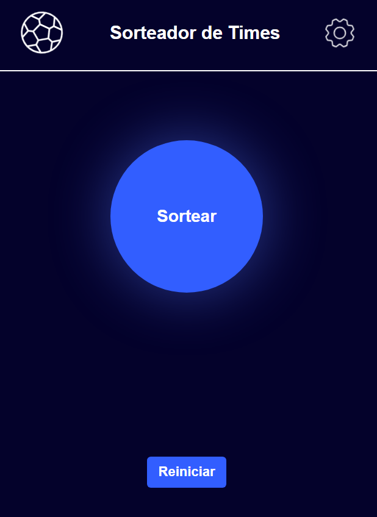
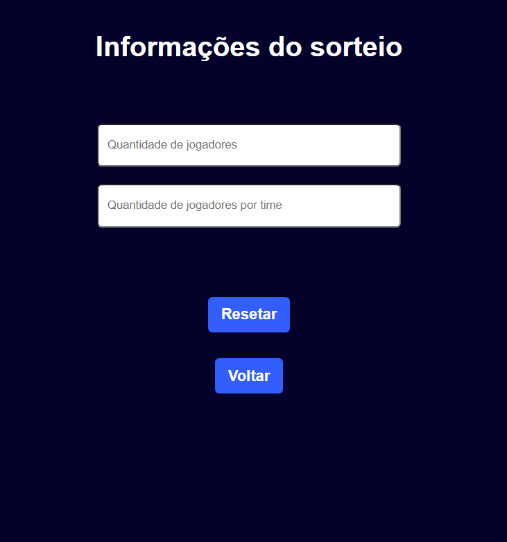

# Random Team Drawing with Colors

## Description
This project allows the drawing of player teams using random colors. The user can configure the number of players and the number of teams to be formed. The teams' colors are drawn based on colors provided by the user, and the drawing process is interactive, with visual feedback and notifications.

## Features

### 1. **Setting the Number of Players and Teams**
   - The user enters the number of players and the number of teams in the form.
   - The number of teams is automatically calculated based on the number of players and the number of players per team.
   - The number of teams is displayed on the interface and saved in `localStorage`.

### 2. **Color Selection**
   - The user can select a color for each team using color input elements (color picker).
   - Each selected color is saved in `localStorage`, ensuring that the user's preferences are persisted across sessions.
   - If there are more than three colors, the drawing will be done randomly to ensure that distinct colors are used for each team.

### 3. **Team Drawing**
   - When the user clicks the button to start the drawing, the application randomly selects a color and assigns a player to that team's color.
   - The drawing process continues until the required number of players for each team is reached.
   - During the drawing, the color of the selected team is displayed in a modal.
   - A notification is shown to the user when all players have been drawn, indicating that the drawing is complete.

### 4. **Visual Feedback and Notifications**
   - When the drawing is made, an animation is triggered to give visual feedback to the user.
   - The browser may also vibrate (if supported) to indicate that the drawing is happening.
   - A modal is displayed with the color of the drawn team, allowing the user to see which team each player has been assigned to.

### 5. **Reset and Restart**
   - The user can restart the drawing or clear all stored data (`localStorage`) if they wish to reconfigure the drawing.
   - The reset button allows the user to clear all saved information and reload the page.

## How to Run the Project

1. Clone or download the repository.
2. Open the `index.html` file in a modern browser (recommended: Chrome or Firefox).
3. Fill in the fields with the number of players and teams in the settings gear.
4. Click the "Draw Teams" button to perform the drawing.

## Dependencies
This project does not rely on external libraries, being built solely with HTML, CSS, and JavaScript.

## Contributions
If you would like to contribute to this project, feel free to **fork** the repository and submit a **pull request**.

## License
This project is licensed under the MIT License.

## Usage Examples

1. **Initial Setup:**
   - Set the number of players (e.g., 10) and the number of teams (e.g., 5). The system will automatically calculate the number of players per team.
   - The number of teams will be displayed on the interface.

2. **Color Selection:**
   - The user can select the teams' colors using the available color pickers.

3. **Drawing Teams:**
   - By clicking "Draw Teams," players are randomly assigned to each team, and the team's color is displayed for the player.

4. **Notification and Modal:**
   - After the drawing is complete, a notification appears on the screen informing the user that the drawing has finished, and a modal shows the drawn team color for each player.

## Screenshots

### Drawing Screen

### Configuration Screen

---

### How the Drawing Works

- **User Input:** The user provides the number of players and teams.
- **Team Calculation:** The number of players is distributed across the teams, and the system calculates how many players will be assigned to each team.
- **Color Selection:** The user selects the colors for the teams. The system randomly assigns players to each team.
- **Visual Notification:** When the drawing is completed, the system notifies the user with a visual cue.

# Sorteio de Times com Cores Aleatórias

## Descrição
Este projeto permite o sorteio de times de jogadores utilizando cores aleatórias. O usuário pode configurar o número de jogadores e o número de times a serem formados. As cores dos times são sorteadas com base nas cores fornecidas pelo usuário, e o sorteio é realizado de forma interativa, com feedback visual e notificações.

## Funcionalidades

### 1. **Configuração do Número de Jogadores e Times**
   - O usuário insere o número de jogadores e o número de times no formulário.
   - A quantidade de times é calculada automaticamente com base na quantidade de jogadores e o número de jogadores por time.
   - O número de times é exibido na interface e salvo no `localStorage`.

### 2. **Seleção de Cores**
   - O usuário pode selecionar a cor de cada time utilizando inputs de cor (color picker).
   - Cada cor selecionada é salva no `localStorage`, garantindo que as preferências do usuário sejam persistidas entre sessões.
   - Se houver mais de três cores, o sorteio será realizado para escolher as cores de forma aleatória, garantindo que os times sejam formados com cores distintas.

### 3. **Sorteio dos Times**
   - Quando o usuário clica no botão para realizar o sorteio, a aplicação escolhe aleatoriamente uma cor e atribui um jogador a um time dessa cor.
   - O sorteio é realizado até que o número de jogadores para cada time seja atingido.
   - Durante o sorteio, a cor do time sorteado é exibida em um modal.
   - Uma notificação é mostrada ao usuário quando todos os jogadores forem sorteados, indicando que o sorteio foi finalizado.

### 4. **Feedback Visual e Notificações**
   - Ao realizar o sorteio, uma animação é acionada para dar feedback visual ao usuário.
   - O navegador também pode vibrar (se suportado) para indicar que o sorteio está ocorrendo.
   - Um modal é exibido com a cor do time sorteado, permitindo que o usuário veja qual time foi sorteado para cada jogador.

### 5. **Limpeza e Reinício**
   - O usuário pode reiniciar o sorteio ou limpar todos os dados armazenados (localStorage), caso deseje reconfigurar o sorteio.
   - O botão de reset permite que o usuário limpe todas as informações salvas e recarregue a página.

## Como Rodar o Projeto

1. Clone ou faça o download do repositório.
2. Abra o arquivo `index.html` em um navegador moderno (recomendado usar Chrome ou Firefox).
3. Preencha os campos com o número de jogadores e de times na engrenagem (configurações).
4. Clique no botão "Sortear Times" para realizar o sorteio.

## Dependências
Este projeto não depende de bibliotecas externas, sendo construído exclusivamente com HTML, CSS e JavaScript.

## Contribuições
Se você deseja contribuir para este projeto, sinta-se à vontade para realizar um **fork** e submeter um **pull request**.

## Licença
Este projeto está licenciado sob a Licença MIT.

## Exemplos de Uso

1. **Configuração Inicial:**
   - Defina o número de jogadores (ex: 10) e o número de times (ex: 5). O sistema calculará automaticamente a quantidade de jogadores por time.
   - O número de times será exibido na interface.

2. **Seleção de Cores:**
   - O usuário pode selecionar as cores dos times utilizando os "color pickers" disponíveis.

3. **Sorteio dos Times:**
   - Ao clicar em "Sortear Times", os jogadores serão atribuídos aleatoriamente a cada time, e a cor do time será exibida para o jogador.

4. **Notificação e Modal:**
   - Após o sorteio, uma notificação aparece na tela informando que o sorteio foi finalizado, e um modal exibe a cor do time sorteado para cada jogador.

## Capturas de Tela

### Tela de Sorteio

### Tela de Configuração

---

### Como Funciona o Sorteio

- **Entrada do Usuário:** O usuário informa o número de jogadores e de times.
- **Cálculo dos Times:** O número de jogadores é distribuído pelos times, e o sistema calcula quantos jogadores vão para cada time.
- **Seleção de Cores:** O usuário escolhe as cores dos times. O sistema sorteia aleatoriamente um jogador para cada time.
- **Notificação Visual:** Quando o sorteio é concluído, o sistema avisa o usuário com uma notificação visual.
